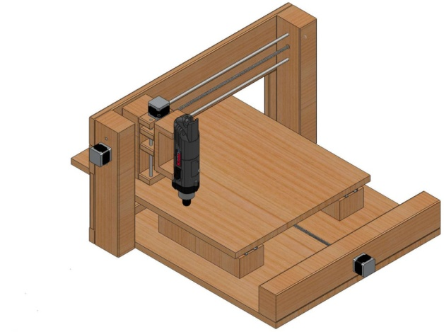

# CNC Milling Machine
- Designed and built a desktop CNC milling machine. 
- Used SolidWorks to provide high-level dimensions of each structural component, and to check for interferences.
- Confirmed electronics (not shown) and CNC software mimic actual designed components. 
- Used global variables and a logical mate pattern of components to ensure model self-updates properly if major dimensions were modified (ie. Parametric design) 

# Software (Fusion 360)
- Autodesk Fusion 360 is 3D CAD software that is similar to Solidsworks, that allows for:
  - Creating models, importing 3D models, and modifying/reshaping models.
  - Creating CNC toolpaths.
- An example of this can be seen at my [Parametric Box](https://github.com/JonGroves/Fusion360_ParametricBox) repository.
